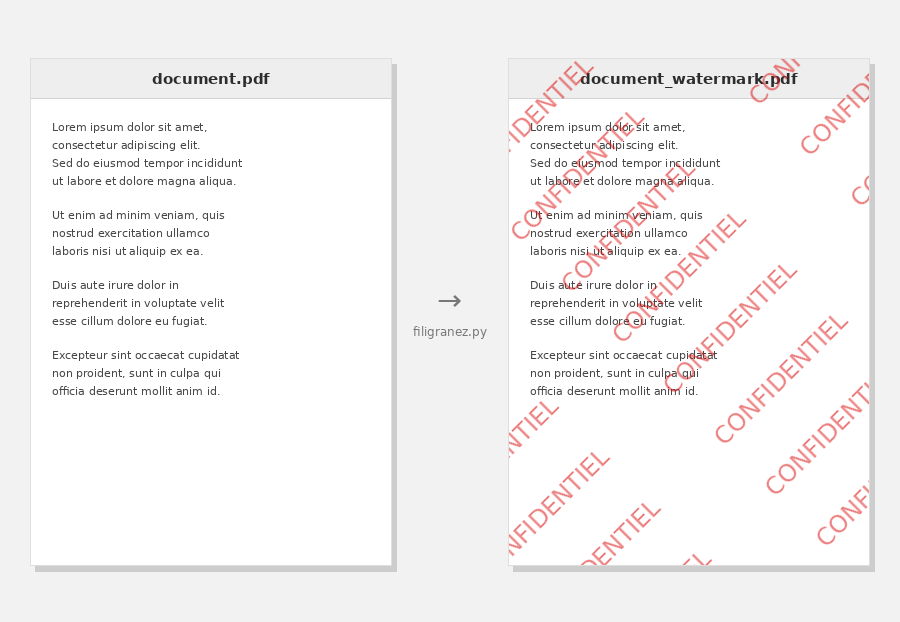
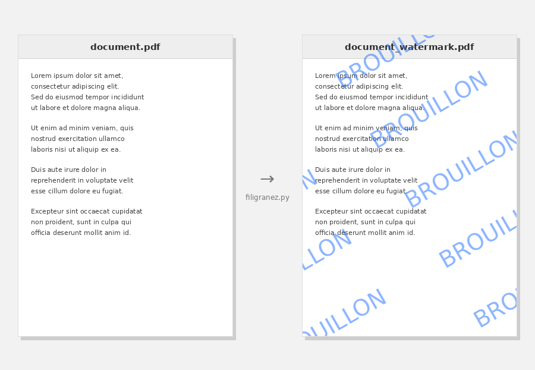
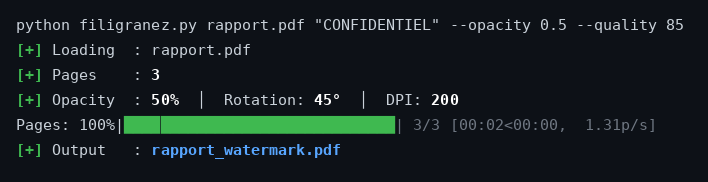

# filigranez

PDF watermarking tool. The watermark is baked directly into the page pixels — it cannot be removed by editing PDF objects or deleting layers.



```bash
python filigranez.py document.pdf "CONFIDENTIEL"
```

---



```bash
python filigranez.py document.pdf "BROUILLON" --color "#1E6FFF" --rotation 30 --font-size 38
```

---

## Output example



---

## How it works

1. Each PDF page is rasterized into an image (via poppler)
2. The watermark text is drawn pixel-by-pixel onto the image (via Pillow)
3. The images are recompiled into a new PDF (via img2pdf)

The resulting PDF contains only raster images — no text objects, no layers, no removable elements.

## Dependencies

### Python packages

```bash
pip install -r requirements.txt
```

`colorama` (colored output on Windows) and `tqdm` (progress bars) are optional — the tool runs without them, falling back to plain per-page log lines.

### System — Linux

```bash
sudo apt-get install poppler-utils
```

### System — Windows

Download and install poppler for Windows: https://github.com/oschwartz10612/poppler-windows/releases

Then pass the bin path with `--poppler-path`.

## Usage

```
filigranez.py <input> <text> [output] [options]
```

### Arguments

| Argument | Description |
|----------|-------------|
| `input` | Input PDF file or directory |
| `text` | Watermark text |
| `output` | Output PDF file (single file mode only, optional) |

### Options

| Flag | Short | Default | Description |
|------|-------|---------|-------------|
| `--opacity` | `-o` | `0.5` | Opacity from 0.0 (invisible) to 1.0 (solid) |
| `--rotation` | `-r` | `45` | Rotation angle in degrees |
| `--dpi` | `-d` | `200` | Rendering resolution (higher = better quality, larger file) |
| `--font-size` | `-f` | auto | Font size in pixels (default: page width / 18) |
| `--color` | `-c` | `#DC1414` | Watermark text color — `#RRGGBB` or a color name (e.g. `red`, `navy`) |
| `--quality` | `-q` | `95` | JPEG quality 1–95 (lower = smaller file, more compression) |
| `--suffix-name` | `-s` | `watermark` | Suffix appended to output filename(s) |
| `--poppler-path` | `-p` | — | Path to poppler `bin/` directory (Windows) |

Output page dimensions are preserved (the rendering DPI is embedded so the resulting PDF matches the original page size).

## Examples

```bash
# Single file, default settings → document_watermark.pdf
python filigranez.py document.pdf "CONFIDENTIEL"

# Custom opacity and rotation
python filigranez.py document.pdf "DRAFT" --opacity 0.3 --rotation 30

# Custom watermark color (hex or name)
python filigranez.py document.pdf "BROUILLON" --color "#1E6FFF"
python filigranez.py document.pdf "SECRET" --color navy

# Smaller output file (more JPEG compression)
python filigranez.py document.pdf "INTERNE" --quality 70

# Explicit output filename
python filigranez.py document.pdf "SECRET" output.pdf

# Entire directory → creates docs_watermark/ preserving subdirectory structure
python filigranez.py ./docs/ "INTERNE"

# Custom suffix → creates docs_confidentiel/
python filigranez.py ./docs/ "CONFIDENTIEL" --suffix-name confidentiel

# High quality
python filigranez.py document.pdf "CONFIDENTIEL" --dpi 300

# Windows with explicit poppler path
python filigranez.py document.pdf "DRAFT" --poppler-path "C:/poppler/bin"
```

## Directory mode

When the input is a directory, the tool:
- Scans recursively for all `.pdf` files
- Preserves the original directory structure in the output
- Creates an output directory named `<input_dir>_<suffix>`
- Leaves original files untouched
- Skips unreadable/corrupt PDFs and keeps going (a summary of failures is printed, and the exit code is non-zero if any file failed)

```
docs/
├── report.pdf
└── contracts/
    └── contract.pdf

docs_watermark/
├── report_watermark.pdf
└── contracts/
    └── contract_watermark.pdf
```

## License

GPL v3 — see [LICENSE](LICENSE)

Any modification or project integrating filigranez must remain open source under the same license.

## Nix / NixOS

A `filigranez.nix` flake is included for reproducible builds with all dependencies pinned.

```bash
nix develop
filigranez document.pdf "CONFIDENTIEL"
```
