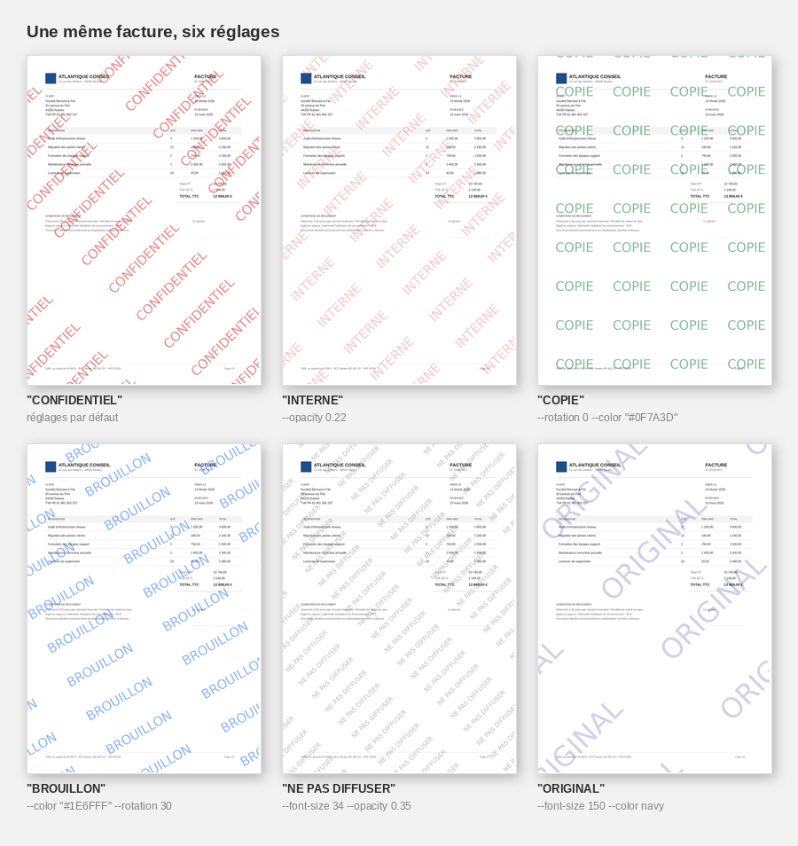
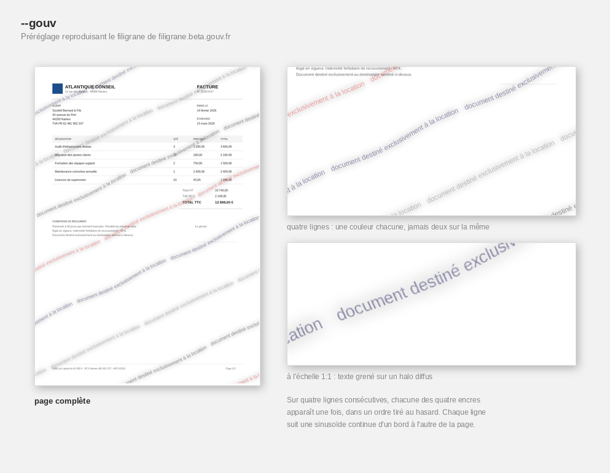
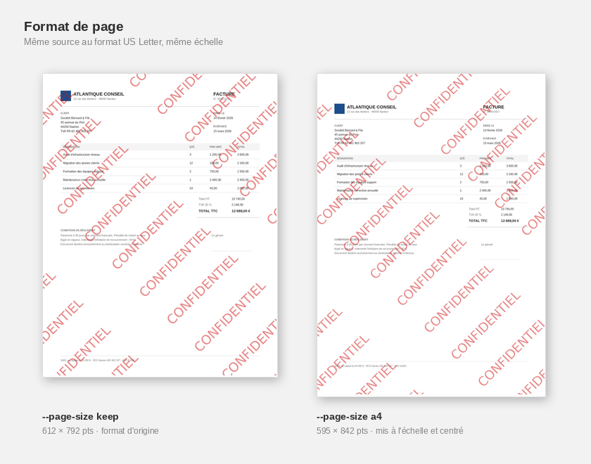

PDF watermarking tool. The watermark is baked directly into the page pixels — it cannot be removed by editing PDF objects, deleting layers, or copying text out.


```bash
python filigranez.py facture.pdf "CONFIDENTIEL"
```

The output goes to `facture_watermark.pdf`, next to the original. Nothing is written over the input.

---

## Install

```bash
pip install -r requirements.txt
```

`colorama` (colored output on Windows) and `tqdm` (progress bars) are optional — the tool runs without them, printing one line per page instead of a bar.

Rendering needs poppler:

```bash
sudo apt-get install poppler-utils          # Debian / Ubuntu
brew install poppler                        # macOS
```

On Windows, download [poppler-windows](https://github.com/oschwartz10612/poppler-windows/releases) and point `--poppler-path` at its `bin/` directory.

---

## Usage

```
filigranez.py <input> <text> [output] [options]
```

### Positional arguments

| Argument | Required | Description |
|----------|----------|-------------|
| `input` | yes | Input PDF file, or a directory to process recursively |
| `text` | yes | The watermark text |
| `output` | no | Output PDF path. Single-file mode only; ignored for a directory. Defaults to `<input>_<suffix>.pdf` |

### Options

| Flag | Short | Default | Description |
|------|-------|---------|-------------|
| `--gouv` | `-g` | off | Alternate style reproducing the filigrane.beta.gouv.fr watermark — see [below](#the---gouv-style) |
| `--opacity` | `-o` | `0.5` | Opacity from `0.0` (invisible) to `1.0` (solid) |
| `--rotation` | `-r` | `45` | Rotation in degrees. `0` is horizontal; negative values tilt the other way |
| `--dpi` | `-d` | `200` | Rendering resolution. Higher is sharper and heavier |
| `--font-size` | `-f` | auto | Font size in pixels. Auto means page width ÷ 18 |
| `--color` | `-c` | `#DC1414` | Text color, `#RRGGBB` or a CSS name such as `navy` |
| `--page-size` | `-P` | `keep` | `keep` preserves the input page size, `a4` normalises every page to A4 |
| `--quality` | `-q` | `95` | JPEG quality, 1–95. Lower means a smaller file |
| `--suffix-name` | `-s` | `watermark` | Suffix appended to output names |
| `--poppler-path` | `-p` | — | Path to poppler's `bin/` directory (Windows) |
| `--help` | `-h` | — | Full list of flags |

Values are validated before any work starts, so a typo fails immediately rather than halfway through a batch.

---

## The options, side by side

The same invoice, six settings:



```bash
python filigranez.py facture.pdf "CONFIDENTIEL"
python filigranez.py facture.pdf "INTERNE" --opacity 0.22
python filigranez.py facture.pdf "COPIE" --rotation 0 --color "#0F7A3D"
python filigranez.py facture.pdf "BROUILLON" --color "#1E6FFF" --rotation 30
python filigranez.py facture.pdf "NE PAS DIFFUSER" --font-size 34 --opacity 0.35
python filigranez.py facture.pdf "ORIGINAL" --font-size 150 --color navy
```

A low `--opacity` keeps the document comfortable to read; a large `--font-size` with a low opacity gives a single sweeping mark instead of a tiled pattern.

---

## The `--gouv` style

`--gouv` swaps the tiled stamp for a second style, matched against the watermark produced by [filigrane.beta.gouv.fr](https://filigrane.beta.gouv.fr) — the French service people use to mark ID documents and payslips before sending them to a landlord or an agency.



```bash
python filigranez.py piece-identite.pdf "document destiné exclusivement à la location" --gouv
```

It differs from the default style in more than its colors:

- **One ink per line**, never two on the same line. Four inks — near-black, light grey, navy and red — are dealt so that any four consecutive lines carry each of them exactly once, in a random order.
- **Each line follows a continuous sine** running the full width of the page, one cycle per repetition of the text. Because the wave never restarts between repetitions, a cut, a splice or a pasted patch breaks the curve and leaves a visible step in an otherwise smooth line.
- **The text is grainy and sits in a soft halo**, rather than being printed crisp.
- Shallower angle (25°), wider line spacing, smaller type, and a lighter overall weight than the default style.

The wave amplitude, the ink order and the per-line weight are derived from the watermark text, so a given text always renders identically while two different texts differ. `--opacity`, `--rotation`, `--color` and `--font-size` still override the preset; `--color` sets the light grey of the palette, the three other inks are fixed.

---

## Page size

By default the input page size is preserved. Pass `--page-size a4` to normalise every page to A4:



Pages are scaled to fit and centred, keeping their aspect ratio — nothing is stretched or cropped, so a Letter page comes out as A4 with a white band top and bottom. A page that is already A4 passes through untouched rather than being resampled, and a landscape page becomes landscape A4 rather than being rotated. Normalisation happens before the watermark is drawn, so the watermark covers the added margins too.

---

## Directory mode

Point `input` at a directory and every `.pdf` under it is processed:

```bash
python filigranez.py ./dossiers/ "INTERNE"
```

```
dossiers/                        dossiers_watermark/
├── rapport.pdf          →       ├── rapport_watermark.pdf
└── contrats/                    └── contrats/
    └── bail.pdf                     └── bail_watermark.pdf
```

- Scans recursively, preserving the directory structure
- Writes to a sibling directory named `<input_dir>_<suffix>`
- Leaves the originals untouched
- Skips unreadable or corrupt PDFs and keeps going; a summary is printed at the end and the exit code is non-zero if any file failed
- Processes duplicates once (symlinks, or case-variant names on case-insensitive filesystems)

Use `--suffix-name` to rename both the directory and the files:

```bash
python filigranez.py ./dossiers/ "CONFIDENTIEL" --suffix-name confidentiel
# → dossiers_confidentiel/rapport_confidentiel.pdf
```

---

## Output


The progress bar follows the actual work rather than the page count, so it still moves on a single-page document. It disappears when output is redirected to a file or a pipe, where one line per page is printed instead, without escape codes. Colors are dropped when `NO_COLOR` is set, and box-drawing characters fall back to plain ASCII on consoles that cannot encode them.

---

## More examples

```bash
# Explicit output filename
python filigranez.py facture.pdf "SECRET" archive/facture-2026.pdf

# Print quality
python filigranez.py facture.pdf "CONFIDENTIEL" --dpi 300

# Smaller file, for email
python filigranez.py facture.pdf "INTERNE" --quality 70 --dpi 150

# Discreet mark on a document meant to stay readable
python filigranez.py contrat.pdf "COPIE NON CERTIFIÉE" --opacity 0.2 --font-size 40

# Normalise a batch of mixed formats to A4
python filigranez.py ./scans/ "ARCHIVE" --page-size a4

# The alternate style, over a whole folder
python filigranez.py ./pieces/ "réservé au dossier de location" --gouv

# Windows
python filigranez.py facture.pdf "DRAFT" --poppler-path "C:/poppler/bin"
```

---

## How it works

1. Each page is rasterised with poppler
2. The watermark is drawn onto the pixels with Pillow
3. The pages are recompiled into a PDF with img2pdf

The result contains only raster images — no text objects, no annotations, no optional content groups, nothing selectable or deletable.

Pages are rendered and composited one at a time, so memory stays flat regardless of document length. When consecutive pages share dimensions — the usual case — the watermark layer is computed once and reused.

---

## Safety checks

- Refuses to write the output over the input file
- Validates `--opacity`, `--dpi`, `--font-size`, `--quality`, `--page-size` and `--color` before doing any work
- Rejects empty watermark text
- Creates missing output directories rather than failing at the last step

---

## Nix / NixOS

A `flake.nix` is included for reproducible builds, poppler included.

```bash
# Shell with filigranez and all dependencies
nix develop
filigranez facture.pdf "CONFIDENTIEL"

# Or run it directly, installing nothing
nix run . -- facture.pdf "CONFIDENTIEL"
```

---

## License

GPL v3 — see [LICENSE](LICENSE).

Any modification, or any project integrating filigranez, must remain open source under the same license.
